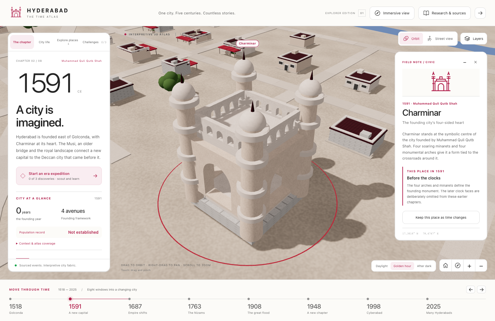

# The Time Atlas

**What if your history lesson came with a time machine?**

Think **Age of Empires-style city exploration**, but the mission is to discover how
the world's cities changed over the centuries: historical dioramas, source-linked
stories and current geographic maps, not a combat game.

Walk through Hyderabad before Charminar existed. Follow London's river, explore
ancient Giza long before Cairo, or watch Edo become Tokyo. Cross to New York,
Rio de Janeiro and Sydney. Then jump to the modern map and find what survived.

### [Step into the time machine →](https://mkjsanghvi29.github.io/hyderabad-time-atlas/)

Free to explore in your browser. No account, installation or API key. Geographic maps
stream public map data; the illustrated atlas also works offline.

## Seven cities. Six continents.

Use **Explore the world** in the header to change cities. Each new city has six
independent historical chapters, period-gated landmarks, city-life stories,
source-linked statistics and a self-guided place trail. The modern chapter opens
current streets, mapped building footprints and terrain; the expanded map lets you
search or navigate beyond the curated landmarks.

| City | A different urban story |
| --- | --- |
| [Hyderabad](https://mkjsanghvi29.github.io/hyderabad-time-atlas/?city=hyderabad) | Fortified capital, planned city, technology metropolis |
| [London](https://mkjsanghvi29.github.io/hyderabad-time-atlas/?city=london) | Roman river port, fire, rebuilding and global connections |
| [Cairo & Giza](https://mkjsanghvi29.github.io/hyderabad-time-atlas/?city=cairo) | Ancient necropolis, successive Nile capitals and the modern metropolis |
| [Tokyo](https://mkjsanghvi29.github.io/hyderabad-time-atlas/?city=tokyo) | Edo, imperial capital and repeated urban reinvention |
| [New York](https://mkjsanghvi29.github.io/hyderabad-time-atlas/?city=new-york) | Lenape homeland, colonial port and a city of five boroughs |
| [Rio de Janeiro](https://mkjsanghvi29.github.io/hyderabad-time-atlas/?city=rio) | Indigenous bay, colonial and imperial capital, landscape and inequality |
| [Sydney](https://mkjsanghvi29.github.io/hyderabad-time-atlas/?city=sydney) | Aboriginal harbour country, colonisation and metropolitan growth |

The six new cities are **non-audio editions**. Hyderabad keeps its existing
documentary tour, eight chapters and learning challenges; no other city
downloads or plays narration.

[](https://mkjsanghvi29.github.io/hyderabad-time-atlas/?year=1591&place=charminar)

## Pick your adventure

- **Documentary traveller (Hyderabad):** choose **Audio tour** for a narrated journey through all eight eras. Sixteen stops, one original male guide, a quiet ambient score, and gentle camera moves. Pause, skip, read the transcript—or look around without stopping the narration.
- **Time traveller:** eight chapters, from Golconda in **1518** to metropolitan Hyderabad in **2025**.
- **City-growth spotter:** 1998 opens as an illustrated 3D city. Choose **1998 satellite reference** to compare real **1998 and 2025 Landsat observations**. These are zoom-limited, top-down overviews—not street photography.
- **Street explorer:** discover mapped streets, building footprints and terrain. Search Hyderabad's landmarks, parks, streets and other places by name—or choose **any point**. The handful of atlas pins are not the limits.
- **History detective (Hyderabad):** tackle **24 mini-challenges**, follow field hints and collect **eight chapter badges**. Mistakes cost nothing; progress stays in your browser.
- **Pattern spotter:** keep a monument selected as time changes. Notice changing buildings, city milestones and source-linked population benchmarks.
- **Story collector:** open **City life** for period-specific stories and surprising details, with sources to follow when curiosity strikes.

## Less memorising. More discovering.

This is an experiment in making history something you **do**, not just something you read.
For classrooms, families and curious solo explorers, it could turn a lesson into a field
trip: navigate, notice a change, ask why, and follow the evidence.

**Try this five-minute history quest:**

1. Visit **1591** and scout Charminar and the older river crossing.
2. Select **Golconda Fort**, choose **Keep this place as time changes**, and jump to **2025**. Choose **Illustrated atlas** to compare the historical models. What changed?
3. Open **Challenges**. Earn a badge, then ask which parts of the scene are documented and which are reconstruction.

The teaching potential goes beyond dates: geography, urban change, heritage conservation
and learning to question a source. Compare how rivers, ports, colonial rule or railways
changed different cities, without assuming they share the same historical milestones.
Teacher-designed quests and multilingual lesson trails
are possibilities for the future, not features already built.

> **A time machine with footnotes.** This is a stylized, source-linked interpretation, not
> photorealism or a surveyed digital twin. The modern map uses current geographic data;
> building coverage varies and some heights are estimated. The illustrated historical
> streets and neighbourhoods are reconstruction; generic landmark miniatures are not
> exact period architectural models. Population records keep their actual census dates
> and boundaries, and missing early counts are not invented. Ancient Giza is a
> regional chapter, not a claim that Cairo already existed.
> [Read the research behind the reconstruction.](RESEARCH.md)

<details>
<summary><strong>Run your own time machine</strong></summary>

Requires Node.js 22.12+ and npm.

```bash
git clone https://github.com/mkjsanghvi29/hyderabad-time-atlas.git
cd hyderabad-time-atlas
npm ci --legacy-peer-deps
npm run dev
```

The legacy peer flag works around an npm resolver issue with the build-plugin peers.

```bash
npm test
npm run build
```

Open **`dist/index.html`** for the illustrated offline edition. The historical models,
stories and challenges are embedded. Geographic maps, imagery, elevation and external
source links require internet access.

Recorded narration loads one stop at a time, only after you choose to start. For offline
audio, keep **`dist/narration/`** alongside the HTML file; the HTML alone contains the
transcripts, not the recordings. Music is synthesized locally and has its own mute/volume
controls. The voice is an original synthetic narrator, not a celebrity recording.

In the modern geographic view, type a place name and press **Go** to search beyond the
atlas collection. Submitted names go to Photon; typing and coordinate entry stay local.
Search uses current OpenStreetMap records, not a historical directory. Public map/search
services are best-effort; coverage varies and a large deployment should use its own provider.

Built with React, TypeScript, Three.js and MapLibre. Original historical miniatures;
credited OpenStreetMap/OpenFreeMap cartography and Mapterhorn terrain. No commercial
game assets. GitHub Actions publishes `main` to GitHub Pages automatically.

Browser journeys: `npx playwright install chromium`, then `npm run test:e2e`.
Include live map-provider journeys with `ATLAS_LIVE_MAPS=1 npm run test:e2e`.

City content lives in `src/world/cities/`, following the typed schema in
`src/world/types.ts`. New-city timelines are data, not separate applications:
the historical renderer, current map lifecycle, place search and interface are shared.
Hyderabad's original richer reconstruction stays isolated to preserve its historical
models, imagery rules and audio integration.

</details>
